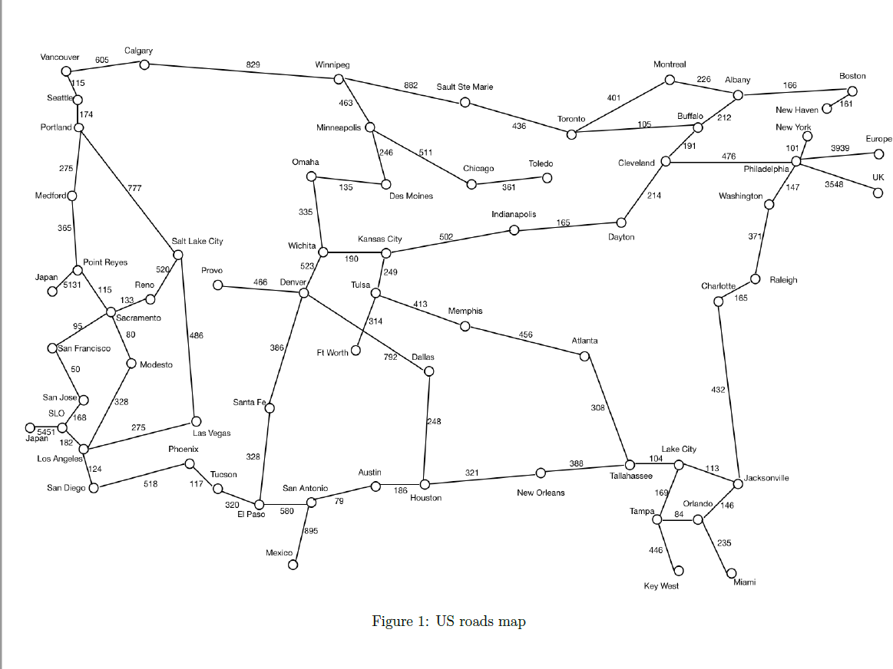

# BFS, DFS and A* search algorithms

given a valid source and destination, gives a valid solution path depending on the search algorithm used.

<h1> use./a.out SearchUSA searchtype srccity destcity to perform the search<h1>

searchtype can be bfs, dfs or astar.
check the roads.txt file for all available cities.

